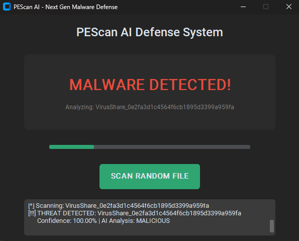
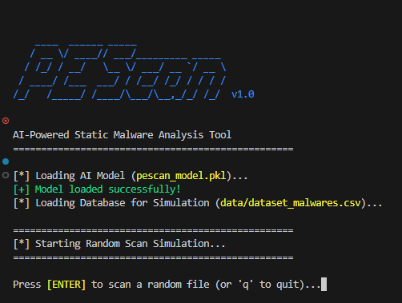
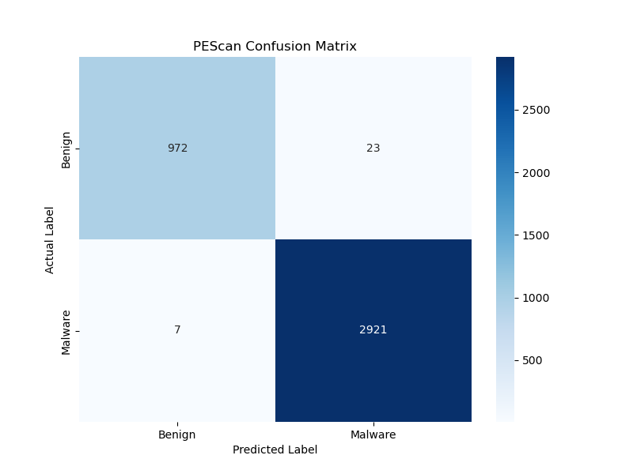
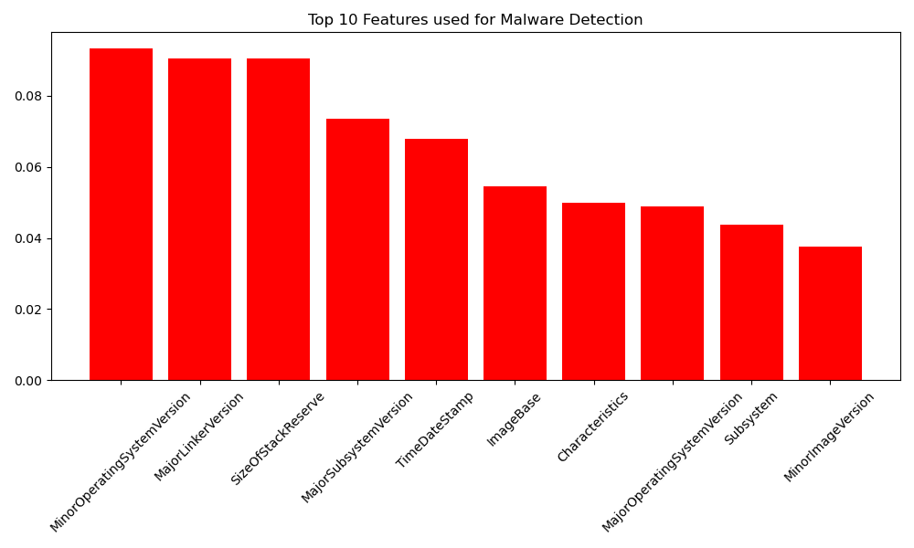

# 🦠 PEScan - AI-Powered Static Malware Analysis Tool


**PEScan** is a next-generation malware detection tool that uses **Machine Learning** to identify malicious files without executing them (Static Analysis). By analyzing the **PE (Portable Executable) Header** anomalies, it detects zero-day threats with high accuracy.

It features both a **Command Line Interface (CLI)** for automation and a **Modern GUI** for user-friendly analysis.

| Modern GUI | CLI Output |
| :---: | :---: |
|  |  |
| *Real-time Malware Detection Dashboard.* | *Detailed terminal analysis.* |

## Model Performance

Accuracy with data visualization:

| Confusion Matrix | Feature Importance |
| :---: | :---: |
|  |  |
| *Visual proof of True Positives.* | *Top PE attributes used for detection.* |

## Key Features

* ** AI-Driven Detection:** Uses a trained **Random Forest Classifier** on 19,000+ samples.
* ** Modern GUI:** A dark-themed, hacker-style interface built with `CustomTkinter`.
* ** Static Analysis:** Extracts features safely without executing the file.
* ** High Accuracy:** Achieved **99.24% accuracy** on the test dataset.

## Installation

1.  **Clone the repository:**
    ```bash
    git clone https://github.com/sevvallaydogann/PE-Scan.git
    cd PE-Scan
    ```

2.  **Install dependencies:**
    ```bash
    pip install -r requirements.txt
    ```

3.  **Setup Dataset:**
    * Download `dataset_malwares.csv` from [Kaggle](https://www.kaggle.com/datasets/amauricio/pe-files-malwares).
    * Place it inside the `data/` folder.

## Usage

### Option 1: Graphic Interface (GUI) 
Run the modern dashboard:
```bash
python gui.py
```

### Option 2: Command Line (CLI)
```bash
python scan.py
```

### Model Training
```bash
python train_model.py
```

## Project Structure
```text
PEScan/
│
├── data/                 # Dataset folder
├── images/               # Screenshots & Graphs
│   ├── gui_demo.png      # GUI Screenshot
│   ├── demo_scan.png     # CLI Screenshot
│   ├── confusion_matrix.png
│   └── feature_importance.png
├── pescan_model.pkl      # Trained AI Brain
├── gui.py                # Graphical User Interface
├── scan.py               # CLI Scanner Tool
├── train_model.py        # Training & Visualization Script
├── requirements.txt      # Dependencies
└── README.md             # Documentation
```

## Disclaimer
FOR EDUCATIONAL PURPOSES ONLY. This tool demonstrates the application of AI in Cybersecurity.
